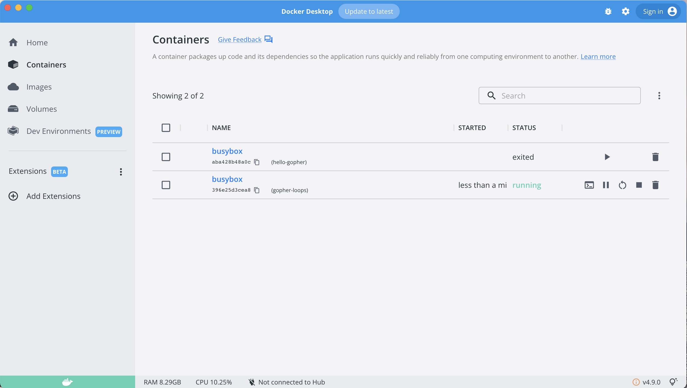

# Task Management application using Go

A simple task system using Go Docker SDK.

## Prerequisites

- Go (tested with 1.17.2)
- Docker

## Steps to Run

- Clone the repository

```sh
git clone https://github.com/dockersamples/gopher-task-system.git
```

- Project directory structure

```
$ tree
.
├── LICENSE
├── README.md
├── go.mod
├── go.sum
├── internal
│   ├── container-manager
│   │   └── container_manager.go
│   ├── task-runner
│   │   └── runner.go
│   └── types
│       └── task.go
├── main.go
└── task.yaml

4 directories, 9 files
```

- Build the task system

```sh
go build -o gopher
```

- Run tasks

```sh
$ ./gopher run task.yaml

preparing task -  gopher-loops
preparing task -  hello-gopher
starting task -  gopher-loops
starting task -  hello-gopher
completed task -  hello-gopher
completed task -  gopher-loops
```



- Run `docker ps -a` to see what all task containers

```sh
$ docker ps -a
CONTAINER ID   IMAGE     COMMAND                  CREATED         STATUS                     PORTS     NAMES
396e25d3cea8   busybox   "sh -c 'for i in `se…"   6 minutes ago   Exited (0) 6 minutes ago             gopher-loops
aba428b48a0c   busybox   "echo 'Hello, Gopher…"   6 minutes ago   Exited (0) 6 minutes ago             hello-gopher
```

## Sequence Diagram

```sequence
Task System->Task Runner: Create tasks from YAML
Note left of Task System: User submits a YAML Task Definition
Task Runner->Container Manager: Pull Docker image for task
Container Manager->Docker: Pull Docker image for task
Task Runner->Container Manager: Create container for task
Container Manager->Docker: Create container for task
Docker-->Container Manager: containerID
Container Manager-->Task Runner: containerID
Task Runner->Container Manager: Start containerID
Container Manager->Docker: Start containerID
Task Runner->Container Manager: Wait for containerID
Container Manager->Docker: Wait for containerID
Docker-->Container Manager: Status for containerID
Container Manager-->Task Runner: Status for containerID
Task Runner-->Task System: Status of tasks
```
